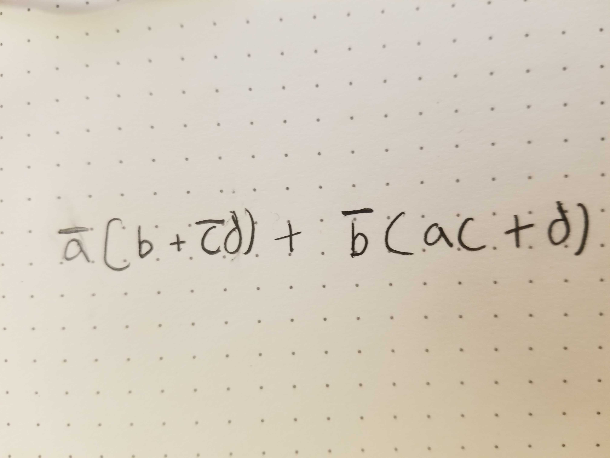

# Recitation Assignment 0999999999

## Homework
### Due Tonight  

Your homework is in the `for-homework` directory. Note that there
are two parts - `part1` and `part2`.

#### Part 1

For Part 1, within the `part1` directory, you are to only change
the `sol1.txt` file. In this part, you will be completing the
truth table for a boolean expression.

Let's take a look at what is in `sol1.txt` already:

```
a b c d
0 0 0 0  | 0 
0 0 0 1  | 1
0 0 1 0  | 
0 0 1 1  |
0 1 0 0  | 
0 1 0 1  | 
0 1 1 0  | 
0 1 1 1  | 
1 0 0 0  |
1 0 0 1  | 
1 0 1 0  | 
1 0 1 1  | 
1 1 0 0  | 
1 1 0 1  |
1 1 1 0  |
1 1 1 1  |
```

The first line is the header for the columns. Each header is the
name of the variable for that column. Then, within each column is
the value for that variable.
A `0` represents `false` while a `1` represents `true`.
Within each line, there is a verticle line, `|`, separating the
values of the variables from the value of the expression.


In the first line after the header,
```
0 0 0 0 | 0
```
each variable is `false`, and the output of the expression is also
`false`. In the line following that, 
```
0 0 0 1 | 1
```
`a`, `b`, and `c` are `false` but `d` is `true`. The output of the
expression is `true` here.

Your task is to fill out the rest of the file adding a 0 or 1 after
the `|` for whether the expression is true or false for the given
values of the variables.

The expression you are dealing with is located in `expr.jpg`,
it is also listed below:


To check if your formatting is OK, you can run `make` within the 
`prob1` directory. Note that this will NOT tell you whether your
answer is good or not - it will only tell you **BAD FORMATTING** if
your table is improperly formatted and **GOOD FORMATTING** if 
the grading script can read your table.


#### Part 2

For Part 2, within the `part2` directory, you are to only change
the `sol2.txt` file.

For this part, you are to write a boolean expression for a given
truth table.

Variables are all one letter long. The only supported things are
NOT, AND, OR, and grouping with parens.

For `OR` you are to use `+`.  
For `NOT` you are to write `~` BEFORE the variable or 
sub-expression you are negating.  
For `AND` you are simply to write the two 
sub-expressions touching each other.  

For example, to write `a or b`, you are to write `a + b`.  
To write `a and b` you are to write `ab`.  
To write `a and b and not c`, you write `ab~c`.  
To write `a and (b or c)` you may write `a(b + c)`.  

The truth table you are to write the expression for is in
`part2/table.txt`. It is also listed below:

```
a b c d
0 0 0 0  | 0
0 0 0 1  | 0
0 0 1 0  | 1
0 0 1 1  | 1
0 1 0 0  | 0
0 1 0 1  | 0
0 1 1 0  | 1
0 1 1 1  | 1
1 0 0 0  | 1
1 0 0 1  | 0
1 0 1 0  | 0
1 0 1 1  | 0
1 1 0 0  | 0
1 1 0 1  | 1
1 1 1 0  | 0
1 1 1 1  | 1
```

You can run `make` within the `prob2` directory to evaluate your
expression. It will say **BAD EXPRESSION** if it can't read what
you typed in `sol2.txt`, otherwise it will print out a truth table.
It is up to you to make sure the truth table there matches the one
above. It will also tell you if it could read your expression or not.
Make sure that it can
(it will say "I was able to read your expression"),
and also make sure the truth table `make` produces matches the
one in `table.txt` (which is also listed above). Note that you
may name your variables different things and the order may be
different, but you might as well just use `a b c d` as your variables.
